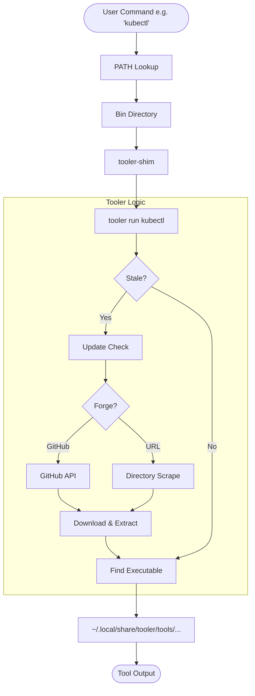

# Tooler

A CLI tool manager for GitHub Releases written in Rust.

## Features

- **Forge Support**: Seamlessly manages tools from GitHub Releases and direct URLs
- **Direct URL Installation**: Install and shim any binary or archive from the internet directly
- **Intelligent Discovery**: Automatically detects tool names and versions from URLs and attempts to discover updates via directory scraping
- **Platform Detection**: Automatically detects your OS and architecture to download the right binaries
- **Archive Support**: Extracts tar.gz, tar.xz, and zip archives
- **Python Support**: Installs Python tools from wheel files with virtual environments
- **Auto-shimming**: Creates command-line shortcuts for installed tools
- **Update Checking**: Automatically checks for tool updates
- **Configuration**: Persistent configuration with environment variable overrides
- **Version Pinning**: Pin tools to specific versions to prevent auto-updates
- **Complex Version Support**: Handle GitHub release tags with slashes (e.g., infisical-cli/v0.41.90)

## How it Works



Tooler manages your CLI tools by abstracting the installation and update process through a shimming system:

1. **Entry Points**: When you install a tool, Tooler creates a symlink in your `bin-dir` (e.g., `k9s` -> `tooler-shim`).
2. **Transparent Execution**: When you run a tool, the shim transparently invokes `tooler run`.
3. **Automated Lifecycle**: Tooler checks if the tool is "stale" based on your `update-check-days` setting. If stale, it queries the GitHub API for the latest release and auto-updates the binary.
4. **Isolated Storage**: Binaries are stored in versioned directories under your data path, keeping your primary system directories clean and preventing version conflicts.

## Installation

### Bootstrapped

```bash
tooler pull morgaesis/tooler
```

### Quick Install (curl-pipe)

```bash
curl -sSL https://raw.githubusercontent.com/morgaesis/tooler/main/install.sh | bash
```

### From Source

```bash
git clone https://github.com/morgaesis/tooler
cd tooler
cargo install --path .
```

## Usage

### Universal URL Installation

Tooler can install and manage tools directly from a URL. It attempts to guess the name and version from the URL path.

```bash
# Install kubectl from official source
tooler run https://dl.k8s.io/release/v1.31.0/bin/linux/arm64/kubectl --version

# Install a tool from a specific archive URL
tooler run https://example.com/downloads/mytool-v1.0.0-linux-amd64.tar.gz --help
```

### Basic Commands

```bash
# Run a specific version
tooler run nektos/act@v0.2.79 --version

# Run with complex GitHub tag (tags with slashes)
tooler run infisical/infisical@infisical-cli/v0.41.90 --version
```

### Configuration Details

```bash
# Show full configuration (plain text is the default)
tooler config show

# Export configuration as JSON
tooler config show --format json

# Get a specific setting
tooler config get update-check-days

# Set a setting (both formats supported)
tooler config set auto-shim=true
tooler config set auto-update true

# Unset a setting (revert to default)
tooler config unset auto-shim
```

### Shell Integration

To use `tooler` and the tools it manages, add the following to your shell profile (`.bashrc`, `.zshrc`, etc.). The installation script handles this automatically for standard setups:

```bash
# Path for tooler and managed tool shims
export PATH="$HOME/.local/share/tooler/bin:$PATH"
```

This ensures both `tooler` and your installed tools (like `k9s`, `act`, etc.) are available directly in your terminal.

### Advanced Usage

```bash
# Run with explicit asset selection from the tool's GitHub release
tooler run argoproj/argo-cd --asset argocd-darwin-amd64

# Verbose output
tooler -v run act

# Quiet mode (errors only)
tooler -q list

# Run a previously installed tool by short name
tooler run act --help
```

## Settings

Settings are stored in `~/.config/tooler/config.json`. You can configure the location of the settings file by setting the `TOOLER_CONFIG` environment variable.

Settings can also be overridden with environment variables:

- `update-check-days`: Days between update checks (default: 60, env: `TOOLER_UPDATE_CHECK_DAYS`)
- `auto-shim`: Create command-line shims (default: true, env: `TOOLER_AUTO_SHIM`)
- `auto-update`: Automatically update tools on run (default: true, env: `TOOLER_AUTO_UPDATE`)
- `bin-dir`: Directory for binaries and shims (default: `~/.local/share/tooler/bin`, env: `TOOLER_BIN_DIR`)

Logging can be controlled via `LOG_LEVEL` or `TOOLER_LOG_LEVEL` environment variables.

## Architecture Support

Tooler supports a wide range of operating systems (Linux, macOS, Windows) and architectures (x86_64, arm64, arm). If your specific platform or architecture isn't automatically detected or supported, please open an Issue to request your situation to be supported, or open a Pull Request to improve the detection logic.

## Asset Selection

Tooler prioritizes assets based on a [predefined ranking logic](src/platform.rs). The general principle is **specificity**: assets matching both your OS and Architecture are ranked highest, followed by OS-specific and then Architecture-specific matches.

- **Archives** (tar.gz, zip, etc.) are prioritized over direct **Binaries** to ensure all necessary metadata and secondary files are captured.
- **System Packages** (deb, rpm, apk) are used as a fallback for specific OS matches.
- **Python Wheels** serve as the final fallback for universal tool support.

The current priority order is:

1. **Archive with OS + Arch** (tar.gz, zip, tar.xz, tgz)
2. **Binary with OS + Arch** (direct executables)
3. **Package with OS + Arch** (apk, deb, rpm)
4. **Archive with OS only**
5. **Binary with OS only**
6. **Package with OS only**
7. **Archive with Arch only**
8. **Binary with Arch only**
9. **Package with Arch only**
10. **Python wheel** (fallback)

## Development

Edit the source code and verify your changes with the following commands:

```bash
cargo test
cargo clippy
cargo check
```

For fast iterations and direct feedback, you can run Tooler directly from source:

```bash
cargo run -- run nektos/act --help
```

Once you're satisfied with your changes, you can build a release binary:

```bash
cargo build --release
```

## License

MIT (see the [LICENSE](LICENSE))
